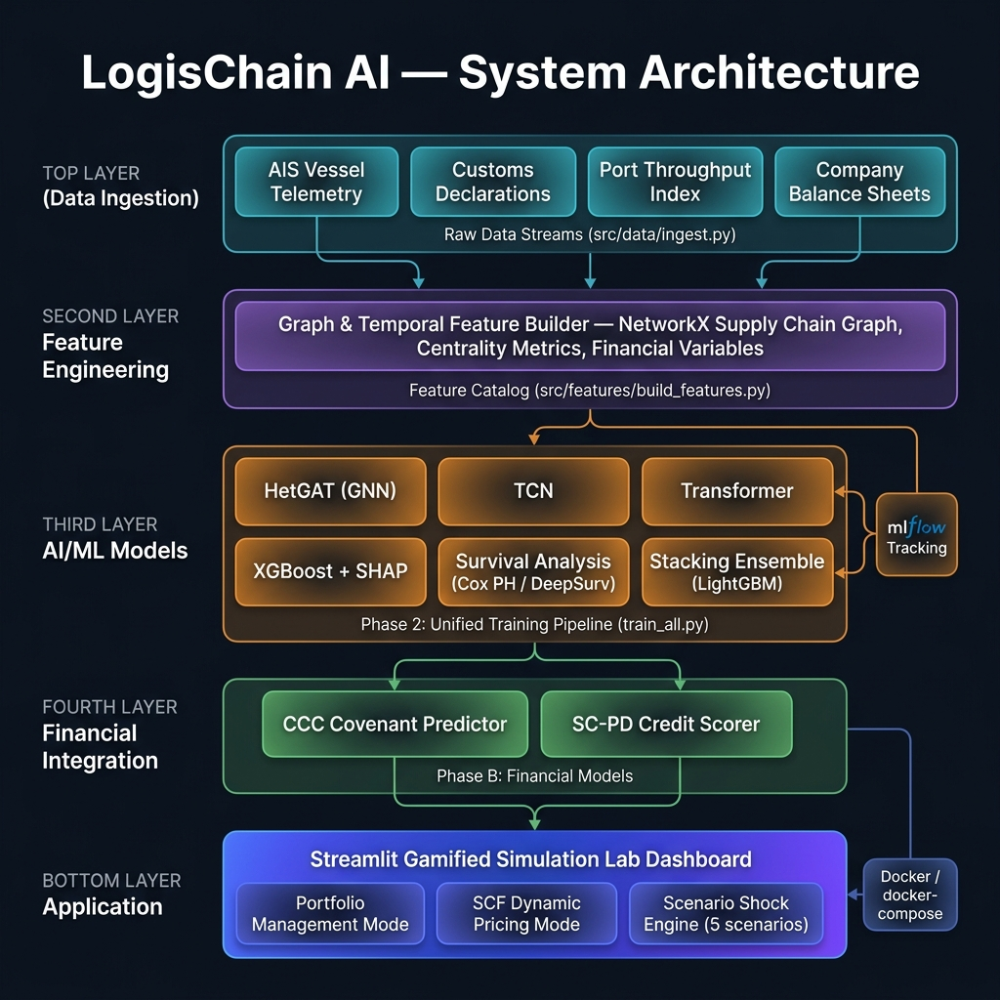
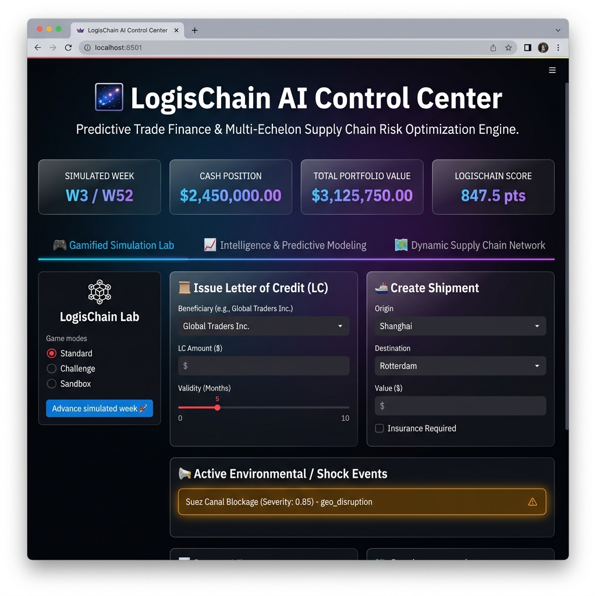

# ⛓️ LogisChain AI: Predictive Trade Finance & Logistics Valuation

**LogisChain AI** is a dual-domain quantitative risk modeling and gamified simulation platform that bridges the gap between real-world supply chain operations and financial risk models (Probability of Default, Cash Conversion Cycle, and Letters of Credit).

---

## 🏛️ System Architecture



## 📸 Screenshots



---

## 🏗️ Repository Layout

The project follows the mandatory submission layout:

```text
logischain-ai/
├── README.md                      # Project setup & timeline documentation
├── requirements.txt               # Locked pip dependencies
├── Dockerfile                     # Environment container setup
├── docker-compose.yml             # Streamlit & MLflow orchestration
├── configs/
│   ├── data_config.yaml           # Simulated ports, coordinates, modes
│   └── model_config.yaml          # GNN, TCN, and Transformer hyperparameters
├── data/
│   ├── raw/                       # Telemetry, customs declarations, financials
│   ├── processed/                 # Supply chain GML graph representations
│   └── features/                  # Precomputed master feature catalog CSV
├── notebooks/
│   └── 01_eda.ipynb               # Seasonal decomposition & network plots
├── src/
│   ├── data/
│   │   └── ingest.py              # Raw data generator
│   └── features/
│       └── build_features.py      # Graph & temporal feature generator
└── tests/                         # Unit testing suite
```

---

## 🚀 Environment Setup

You can run this project locally using either **Docker** (recommended) or **venv + pip**.

### Option A: Docker (Recommended)
Build and spin up the complete network (Streamlit App on `8501`, MLflow Tracking Server on `5000`):
```bash
docker-compose up --build
```

### Option B: Local python venv
1.  **Initialize Environment**:
    ```powershell
    python -m venv venv
    .\venv\Scripts\Activate.ps1
    ```
2.  **Install Requirements**:
    ```powershell
    pip install -r requirements.txt
    ```

---

## ⚙️ Running Phase 1 (Foundation & Setup)

To execute the data ingestion pipeline and calculate the multi-domain features, run:

1.  **Ingest Raw Data Streams**:
    ```bash
    python src/data/ingest.py
    ```
    This generates high-fidelity raw streams (AIS vessel telemetry, customs declarations, port throughput index, and company balance sheets) inside `data/raw/`.

2.  **Build Feature Catalog**:
    ```bash
    python src/features/build_features.py
    ```
    This processes raw CSV streams, builds a supply chain graph structure using NetworkX, computes centralities and concentrations, and merges financial variables to save `data/features/master_features.csv`.

---

## 📈 Running Phase 2 (Unified AI & ML Training Pipeline)

We have implemented a unified pipeline to execute training, hyperparameter optimization via Optuna, logging with MLflow, and local model serialization.

Run the entire training workflow for all 6 models sequentially:
```bash
python train_all.py
```

This trains:
1. **HetGAT (GNN)** on the multi-echelon network topology (`src/models/gnn.py`)
2. **TCN** for temporal operational signals (`src/models/tcn.py`)
3. **Transformer** for physical risk sequence encoding (`src/models/transformer.py`)
4. **XGBoost + SHAP + Optuna** baseline (`src/models/xgboost_model.py`)
5. **Survival Analysis** (Cox Proportional Hazards and DeepSurv) (`src/models/survival.py`)
6. **Stacking Ensemble** (LightGBM meta-learner calibration) (`src/models/ensemble.py`)

Models are serialized inside `data/models/`.

---

## 🛡️ Running Phase B & C (Financial Integration & Simulation Scenarios)

### Financial Predictors
Train the working capital / CCC covenant forecasting and SC-PD credit scorers:
```bash
python src/financial/ccc_predictor.py
python src/financial/credit_scorer.py
```

### Gamified Simulation Lab Dashboard
Run the dark-mode glassmorphic simulation interface:
```bash
streamlit run src/app.py
```
This launches a turn-based interactive sandbox playing simulated turns (weeks), generating letters of credit, routing vessels across 100+ global supply chain nodes under 5 dynamic environmental shock scenarios (e.g., Suez Canal blockage, carrier bankruptcy).

